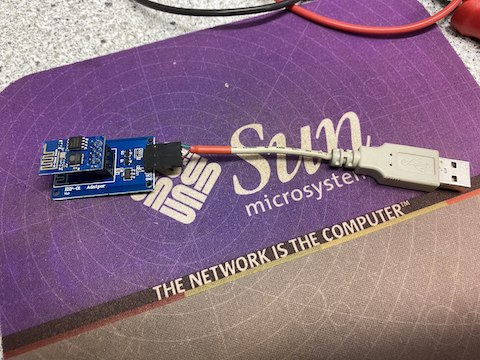
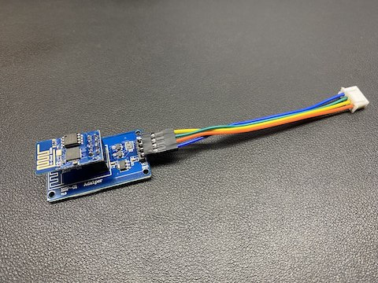

# Creating your own WiFi adapter

Because the dongle which provides the WiFi interface is connected to a UART port it is rather easy to create your own WiFi adapter without using the cloud, the authentication , en/decoding and en/decryption hassle.

Total costs will be less than 5 euro.

The UART port uses 9600bps, 8 databits and no parity.

## Hardware

The signal levels are TTL 5V which means a level shifter is required when using the ESP-01 to convert the signals from 5V to 3.3V and vice versa. Also a voltage regulator is required if you want to power the ESP-01 from the 5V of the UART port. On AliExpress the following adapter for the ESP-01 can be ordered that provides the voltage regulator and level shifters: <https://nl.aliexpress.com/item/4001054021801.html>

Some AC units provide a JST-XH male connector to connect the WiFi SmartKey others provide a Type-A USB female connector (often connected to a JST-XH male connector) to connect the WiFi SmartKey. So you either need a Type-A USB male connector or JST-XH female connector to connect the ESP-01.

The drawing and table show which pins need to be connected.

| ESP-01 adapter | USB | JST-XH |
|-|-|-|
| Gnd | 4 | 4 |
| Vcc | 1 | 1 |
| Rx | 2 | 2 |
| Tx | 3 | 3 |

## Software

You can implement all logic on the ESP-01 or use the ESP-01 as a TCP-Serial bridge and implement the logic on some other system, for instance using this `node-mideahvac` module.

`esp-link` is software for the ESP8266 family that can be installed on the ESP-01 and implements a generic TCP-Serial bridge. The software can be found here: <https://github.com/jeelabs/esp-link>

## Examples

Thanks to Sasha Ludwig for the photo's:

